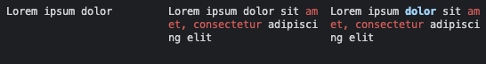

# @jondotsoy/console-draw

The @jondotsoy/console-draw project enables the creation of components for rendering in the terminal, mirroring the functionality of HTML. This includes features to render columns and multi-line text, as well as formatted text.

## Installation

To install @jondotsoy/console-draw, use npm with the following command:

```bash
npm install @jondotsoy/console-draw
```

## API Documentation

### createElement Method

The `createElement` method is a core function in the @jondotsoy/console-draw project. It serves to create components that can be rendered in the terminal.

#### Syntax

```ts
c(name);
c(name, options);
c(name, children);
c(name, options, children);
```

#### Arguments

- `name` `<string>`: The name of the component to be created.
- `options` `<ComponentOptions>`: An object that allows for configuration of how the component will be rendered.
- `children` `<string | Component | Component[]>`: If the component is of type text, a string must be used. Otherwise, other components can be used that will be rendered along with this component.

#### Examples

```ts
import { render, c } from "@jondotsoy/console-draw";

// Example 1: Creating a simple "div" component with two "text" components as children.
render(c("div", [c("text", "text 1"), c("text", "text 2")]));

// Output:
// text 1
// text 2

// Example 2: Creating a single text component without any options or children.
render(c("text", ["Hello, World!"]));

// Output:
// Hello, World!
```

### TextComponent Interface

#### Options

The following options can be used to customize the behavior of the `TextComponent`:

- `width` `<number>`: Specifies the width that the text will occupy when rendered.
- `colors` `<boolean>`: Indicates whether ASCII color support is enabled or not. When set to true, the component will render colors using ANSI escape codes.

#### Examples

```ts
import { render, c } from "@jondotsoy/console-draw";

// Render a simple text component without any options.
render(c("text", "Hello, World!")));

// Output:
// Hello, World!

render(c("text", `${styleText("red", "Hello")}, World!`));

// Output:
// "\u001B[31mHello\u001B[39m, World!"
```

### ColumnsComponent Interface

The `ColumnsComponent` interface is a component in the @jondotsoy/console-draw project that enables rendering of elements in multiple columns.

#### Options

The following options can be used to customize the behavior of the `ColumnsComponent`:

- `gap` `<number>`: Specifies the gap between columns.
- `width` `<number>`: Specifies the width of the rendered content.
- `columns` `<number>`: Specifies the number of columns to render.
- `columnsTemplate` `<{width?:number}[]>`: An array of objects specifying the width of each column. If an object is missing or has a value of null, the corresponding column will have its width automatically calculated.

#### Example

```ts
import { render, c } from "@jondotsoy/console-draw";

// Render three columns with automatically calculated widths.
render(
  c("columns", { columns: 3 }, [
    c("text", `Lorem ipsum dolor`),
    c(
      "text",
      `Lorem ipsum dolor sit ${styleText("red", "amet, consectetur")} adipiscing elit`,
    ),
    c(
      "text",
      `Lorem ipsum ${styleText(["bold", "blue"], `dolor`)} sit ${styleText("red", "amet, consectetur")} adipiscing elit`,
    ),
  ]),
  { width: 80 },
);

// Output:
// "Lorem ipsum dolor         Lorem ipsum dolor sit \u001B[31mam\u001B[39m  Lorem ipsum \u001B[1m\u001B[34mdolor\u001B[39m\u001B[22m sit \u001B[31mam\u001B[39m  \n                          \u001B[31met, consectetur\u001B[39m adipisci  \u001B[31met, consectetur\u001B[39m adipisci  \n                          ng elit                   ng elit                   "
```



### ContentDivisionComponent Interface

The `ContentDivisionComponent` interface is a component in the @jondotsoy/console-draw project that enables grouping and rendering of multiple elements together.

#### Options

The following options can be used to customize the behavior of the `ContentDivisionComponent`:

- `width` `<number>`: Specifies the width of the rendered content.
- `border` `<object>`: Defines the configuration for applying a border to the component. The `border` object has the following properties:
  - `theme`: `<'default' | 'double'>` Applies a simple or double line style to the border.
  - `format`: `<string|string[]>` Applies a specific style to the border.
  - `padding`: `<number>` Creates a margin between the content and the border, if possible.

#### Example

```ts
import { render, c } from "@jondotsoy/console-draw";

render(c("div", [c("text", "text 1"), c("text", "text 2")]));

// Output:
//
// text 1
// text 2

// Render a "div" element with a default border and a width of 40.
render(c("div", { border: {} }, [c("text", "hola")]), { width: 40 });

// Output:
//
// ┌──────────────────────────────────────┐
// │ hola                                 │
// └──────────────────────────────────────┘

// Render a "div" element with a border that has padding and a width of 40.
render(c("div", { border: { padding: 1 } }, [c("text", "hola")]), {
  width: 40,
});

// Output:
//
// ┌────────────────────────────────────────┐
// │                                        │
// │ hola                                   │
// │                                        │
// └────────────────────────────────────────┘
```

## Contributing

### Issues

If you'd like to contribute, please create a new issue on our GitHub repository: https://github.com/JonDotsoy/console-draw/issues/new. This will help us track any bugs or feature requests and ensure that they get the attention they need.

### Roadmap

For information on upcoming changes and features, please refer to our ROADMAP.md document: [ROADMAP.md](./ROADMAP.md). This will give you a sneak peek into what's coming next for console-draw.

## MIT License

This project is licensed under the MIT License.

For more information, please see the license file: [LICENSE](./LICENSE)
